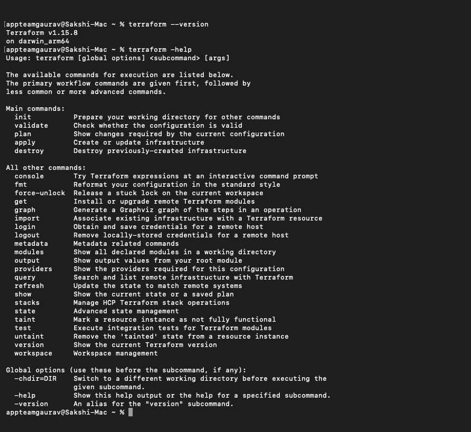
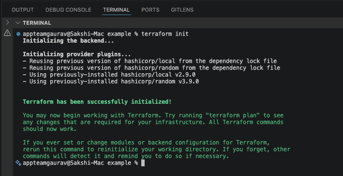
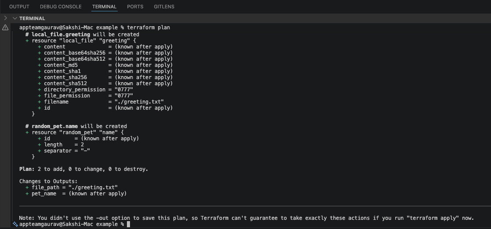
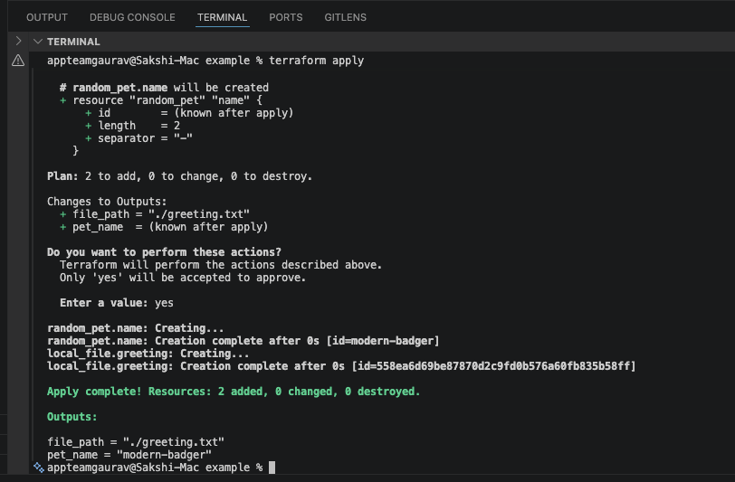
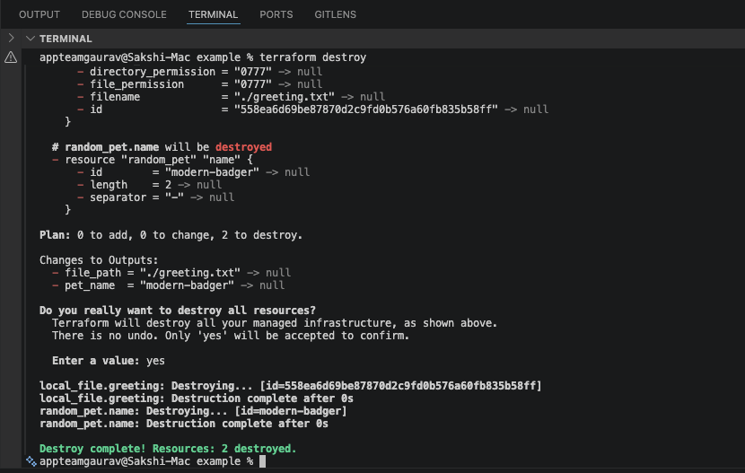

# 🌱 TerraWeek Day 1 — Introduction to IaC & Terraform

**Date:** 15 July 2026 · **Terraform:** v1.15.8 · **OS:** macOS (Apple Silicon)

Day 1 is all about the basics: what Infrastructure as Code is, installing Terraform, and running my very first `terraform apply` — with zero cloud cost.

---

## Task 1: What is IaC & Terraform?

### Infrastructure as Code (IaC)

IaC means writing your infrastructure (servers, files, networks) as **code in text files** instead of clicking buttons in a cloud console.

**Why it's better than clicking around:**

- ✅ **Repeatable** — same code = same result, every time.
- ✅ **Saved in Git** — full history, easy rollback, team review.
- ✅ **Self-documenting** — the code shows exactly what exists.
- ✅ **Fast at scale** — build 50 servers with a loop, not 50 clicks.
- ✅ **Fewer mistakes** — no forgotten setting or wrong region.

### What is Terraform?

Terraform is a tool by **HashiCorp** that lets you describe infrastructure in simple config files, then builds it for you.

**Why it's so popular:**

- **Declarative** — you say *what* you want, Terraform figures out *how*.
- **Works everywhere** — AWS, Azure, GCP, Docker, GitHub, and 1000s more, all with one tool.
- **Safe** — `plan` shows you the changes *before* anything happens.
- **Remembers** — it tracks what it built, so it can update or delete cleanly.

### Terraform vs. others (one line each)

| Tool | How it compares |
|---|---|
| **OpenTofu** | Open-source fork of Terraform — almost identical, community-run. |
| **Pulumi** | Same job, but you code in Python / TypeScript / Go instead of HCL. |
| **CloudFormation** | AWS-only; Terraform works across all clouds. |
| **Ansible** | Best for *configuring* existing servers; Terraform *creates* the infra. |

---

## Task 2: Install Terraform ✅

I installed Terraform 1.15.8 and checked it works with `terraform version` and `terraform -help`:



I also installed the **HashiCorp Terraform** extension in VS Code for syntax highlighting and autocomplete.

---

## Task 3: 6 Key Terraform Words (in my own words)

| Term | Meaning | Example |
|---|---|---|
| **Provider** | Plugin that lets Terraform talk to a platform | `hashicorp/local` to manage files |
| **Resource** | One piece of infra you create | `local_file` that writes a file |
| **State** | Terraform's memory of what it built (`terraform.tfstate`) | Stored my pet name `certain-manatee` |
| **Plan** | A preview of what will change | `Plan: 2 to add, 0 to change` |
| **HCL** | The language you write Terraform in | `length = 2` |
| **Module** | A reusable bundle of config (like a function) | A `vpc` module you reuse for dev & prod |

---

## Task 4: My First Terraform Config 🚀

The starter config uses the `random` and `local` providers — **no cloud account, no credentials, no cost.** It just makes up a random pet name and writes it to a file.

### The workflow, step by step

**1. `terraform init`** — downloads the providers and sets up the folder:



**2. `terraform validate` + `terraform plan`** — checks the config and previews the 2 resources it will create:




**3. `terraform apply`** — creates everything (I typed `yes`) and prints the outputs:



```text
Apply complete! Resources: 2 added, 0 changed, 0 destroyed.

Outputs:
file_path = "./greeting.txt"
pet_name  = "certain-manatee"
```

**4. `cat greeting.txt`** — the file Terraform made:

```text
Hello from TerraWeek 2026! 🚀
Your infra pet name is: certain-manatee
```

**5. `terraform destroy`** — cleans everything up (typed `yes`):



```text
Destroy complete! Resources: 2 destroyed.
```

After destroy, `greeting.txt` is gone and the state file is empty. Full circle! ✅

---

## 🍫 Bonus

**Tab completion:**
```bash
terraform -install-autocomplete   # then restart the terminal
```

**What is `.terraform.lock.hcl`?**
It's a lock file made by `terraform init` that pins the **exact provider versions** (random v3.9.0, local v2.9.0) with checksums. Commit it to Git so everyone on the team gets the same versions — just like `package-lock.json` in Node.

**OpenTofu:** a drop-in fork of Terraform. Same config runs with `tofu init` / `tofu plan` / `tofu apply`; the difference is open-source licensing and community governance.

---

## ✅ Day 1 Complete

- Learned what IaC and Terraform are and why they matter.
- Installed Terraform 1.15.8 + the VS Code extension.
- Ran the full workflow: **init → validate → plan → apply → destroy**.
- Key lesson: always read `plan` before `apply`, and `state` is Terraform's source of truth.

#TrainWithShubham #TerraWeekChallenge
