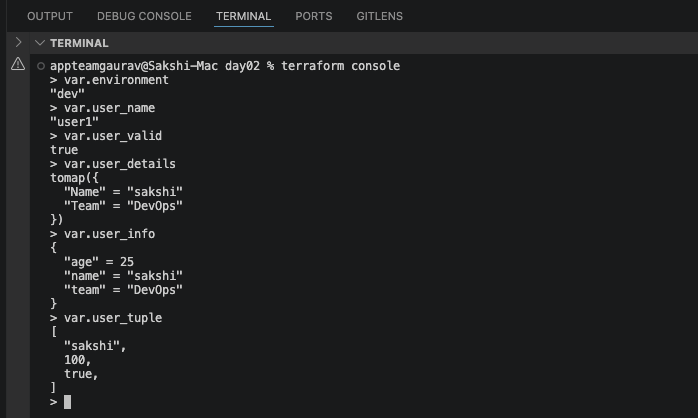
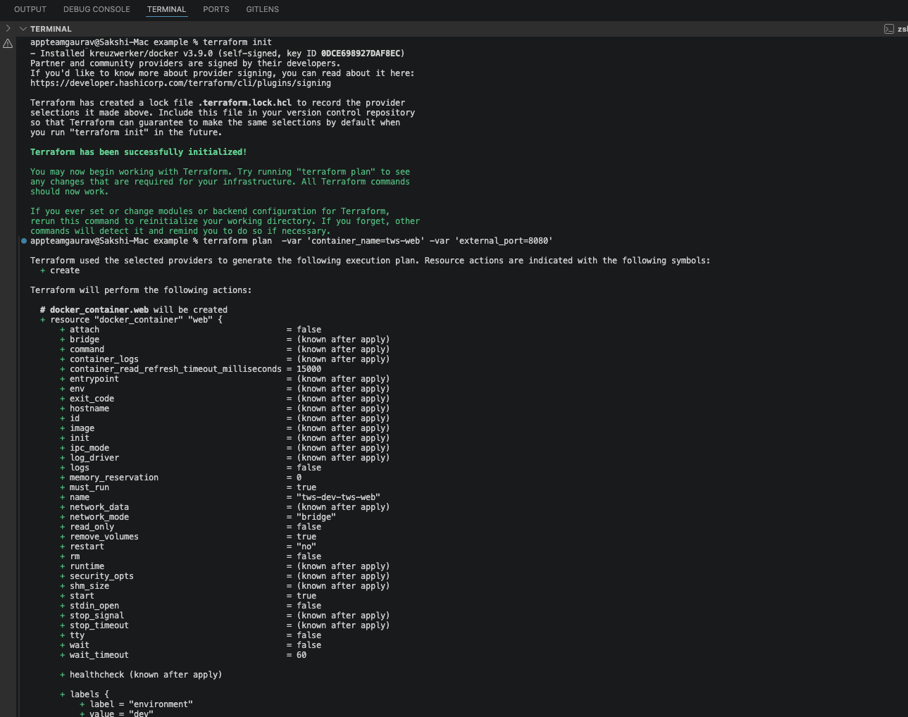
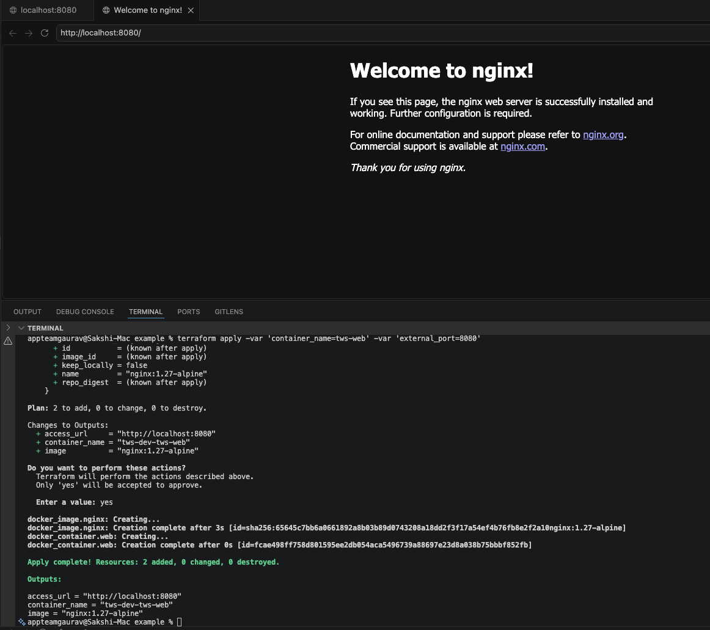

# 🧩 TerraWeek Day 2 — HCL Deep Dive: Variables, Types & Expressions

**Date:** 15 July 2026  
**Terraform Version:** v1.15.8  
**Provider:** kreuzwerker/docker  

Today was about understanding the language behind Terraform — **HCL (HashiCorp Configuration Language)** — and making infrastructure configurations flexible and reusable using:

- Variables
- Types
- Validation
- Locals
- Outputs
- Functions
- Docker Provider

---

# 📂 Project Structure

```text
day02/
│
├── README.md
├── variables.tf
├── local.tf
├── outputs.tf
├── solutions.md
│
├── example/
│   ├── main.tf
│   ├── variables.tf
│   ├── outputs.tf
│   └── terraform.tfvars
│
└── screenshots/
    ├── 01-variables-tf.png
    ├── console.png
    ├── init_plan.png
    ├── apply.png
    └── terraform-destroy.png
```

---

# 🔗 Terraform Files

Click below to view Terraform code:

- [variables.tf](./variables.tf)
- [local.tf](./local.tf)
- [outputs.tf](./outputs.tf)
- [solutions.md](./solutions.md)

## Docker Example Files

- [example/main.tf](./example/main.tf)
- [example/variables.tf](./example/variables.tf)
- [example/outputs.tf](./example/outputs.tf)
- [example/terraform.tfvars](./example/terraform.tfvars)

---

# Task 1: Master HCL Syntax

## Anatomy of a Block

Terraform blocks follow this structure:

```hcl
block_type "label_one" "label_two" {
  argument = value
}
```

Example:

```hcl
resource "docker_container" "web" {

  name  = "tws-web"
  image = docker_image.nginx.image_id

}
```

Explanation:

| Component | Meaning |
|---|---|
| resource | Block type |
| docker_container | First label |
| web | Second label |
| name/image | Arguments |

---

# Argument vs Block

## Argument

An argument assigns a value using `=`.

Example:

```hcl
container_name = "tws-web"
external_port  = 8080
```

---

## Block

A block contains nested configuration.

Example:

```hcl
ports {

  internal = 80
  external = 8080

}
```

Difference:

| Argument | Block |
|-|-|
| Uses `=` | Uses `{ }` |
| Single value assignment | Contains configuration |

---

# Expressions

## String Interpolation

Example:

```hcl
"tws-${var.environment}"
```

Output:

```
tws-dev
```

---

## References

Example:

```hcl
docker_image.nginx.image_id
```

References another Terraform resource attribute.

---

## Operators

Examples:

```hcl
var.external_port > 1024

var.environment == "prod"

true && false
```

---

# Task 2: Variables, Types & Validation

Terraform variable configuration:

➡️ [variables.tf](./variables.tf)


## Supported Types Used

| Category | Type |
|-|-|
| Primitive | string |
| Primitive | number |
| Primitive | bool |
| Collection | list(string) |
| Collection | map(string) |
| Collection | set(string) |
| Structural | object |
| Structural | tuple |

---

## Variables Screenshot


---

## Validation Example

```hcl
variable "environment" {

  description = "Deployment environment"

  type = string

  default = "dev"


  validation {

    condition = contains(
      ["dev","staging","prod"],
      var.environment
    )

    error_message = "environment must be dev, staging or prod."

  }

}
```

Terraform stops execution if invalid values are provided.

Example:

```
environment = production
```

will fail validation.

---

## Sensitive Variable

Example:

```hcl
variable "db_password" {

  type = string

  sensitive = true

}
```

Sensitive values will not be displayed in Terraform output.

---

# Task 3: Locals, Outputs & Functions

## Locals

File:

➡️ [local.tf](./local.tf)


Example:

```hcl
locals {

  name_prefix = "tws-${var.environment}"

  common_labels = merge(
    {
      project = "terraweek"
    },
    var.extra_labels
  )

}
```

Locals help calculate reusable values.

---

# Outputs

File:

➡️ [outputs.tf](./outputs.tf)


Example:

```hcl
output "access_url" {

 value = format(
   "http://localhost:%d",
   var.external_port
 )

}
```

---

# Terraform Console

Run:

```bash
terraform console
```

Examples:

```
> upper("terraweek")

"TERRAWEEK"


> merge({a=1},{b=2})

{
 "a" = 1
 "b" = 2
}


> join("-",["tws","terraweek","2026"])

"tws-terraweek-2026"


> length(["a","b","c"])

3
```

---

## Console Screenshot



---

# Task 4: Build Something Real (Docker Provider)

Terraform Docker example:

➡️ [example folder](./example)

This project uses:

```
kreuzwerker/docker provider
```

It performs:

- Pull Nginx image
- Create Docker container
- Map localhost port
- Manage lifecycle using Terraform

---

# Terraform Commands

## Initialize Provider

```bash
cd example

terraform init
```

Screenshot:



---

## Terraform Plan

Using variables:

```bash
terraform plan \
-var 'container_name=tws-web' \
-var 'external_port=8080'
```

---

## Terraform Apply

```bash
terraform apply \
-var 'container_name=tws-web' \
-var 'external_port=8080'
```

---

## Running Container

Check:

```bash
docker ps
```

Open:

```
http://localhost:8080
```

Expected:

```
Welcome to nginx!
```

Screenshot:



---

# Terraform Output

```bash
terraform output
```

---

# Terraform Destroy

```bash
terraform destroy \
-var 'container_name=tws-web' \
-var 'external_port=8080'
```

Screenshot:


---

# terraform.tfvars vs -var

Instead of passing variables manually:

```bash
terraform apply \
-var 'container_name=tws-web' \
-var 'external_port=8080'
```

Create:

➡️ [terraform.tfvars](./example/terraform.tfvars)


Content:

```hcl
container_name = "tws-web"

external_port = 8080
```

Now run:

```bash
terraform plan

terraform apply
```

Terraform automatically loads `terraform.tfvars`.

---

# Difference

| -var | terraform.tfvars |
|-|-|
| Manual values | Automatic loading |
| Good for temporary changes | Good for projects |
| Longer commands | Cleaner workflow |

---

# Variable Precedence

Highest priority wins:

```
-var / -var-file

        ↓

*.auto.tfvars

        ↓

terraform.tfvars

        ↓

TF_VAR_environment_variables

        ↓

default values
```

---

# Bonus Concepts

## For Expression

```hcl
[for s in var.names : upper(s)]
```

Example:

```
["dev","prod"]

↓

["DEV","PROD"]
```

---

## Conditional Expression

```hcl
var.environment == "prod"
? "large"
: "small"
```

---

## Optional Object Attribute

```hcl
object({

 name = string

 size = optional(string,"small")

})
```

---

# 📸 All Screenshots

## Variables


## Console


## Init and Plan


## Apply


## Destroy


---

# ✅ Day 2 Completed

Completed:

✅ HCL block syntax  
✅ Arguments vs blocks  
✅ Expressions and references  
✅ Terraform variable types  
✅ Validation rules  
✅ Sensitive variables  
✅ Locals and outputs  
✅ Terraform functions  
✅ Terraform console  
✅ Docker provider with Nginx  
✅ terraform.tfvars usage  
✅ Variable precedence  


#TrainWithShubham  
#TerraWeekChallenge  
#Terraform  
#DevOps