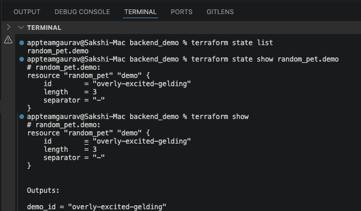

# TerraWeek Day 4 – State & Remote Backends (Native Locking)

**Date:** Wednesday, 15th July 2026

---

# Learning Goals

- Understand Terraform State and its importance.
- Explore Terraform state commands.
- Configure a remote backend using Amazon S3.
- Enable native S3 state locking using `use_lockfile = true`.
- Import existing resources into Terraform.

---

# Task 1: Why State Matters

## What is `terraform.tfstate`?

`terraform.tfstate` is Terraform's state file that keeps track of all infrastructure resources managed by Terraform.

It acts as a source of truth and maps Terraform configuration with real-world infrastructure.

It stores:

- Resource IDs
- Resource attributes
- Dependencies
- Outputs
- Provider information

---

## Why should you never edit Terraform state manually?

Manual editing of the state file can:

- Corrupt the state file.
- Break Terraform resource tracking.
- Cause accidental resource recreation or deletion.
- Create inconsistencies between Terraform and AWS infrastructure.

Terraform state should always be modified using Terraform commands.

---

## Why should you never commit `.tfstate` to Git?

Terraform state may contain sensitive information:

- Database passwords
- API tokens
- IAM credentials
- Connection strings
- Sensitive outputs

Also, committing state files can create conflicts between team members.

Add this to `.gitignore`:

```gitignore
*.tfstate
*.tfstate.*
.terraform/
```

---

## What is State Drift?

State drift happens when infrastructure changes outside Terraform.

Example:

1. EC2 instance created using Terraform.
2. Someone changes the instance type manually from AWS Console.
3. Terraform state and real infrastructure become different.

Useful commands:

```bash
terraform plan
terraform refresh
```

`terraform plan`:

- Detects differences between Terraform state and actual infrastructure.

`terraform refresh`:

- Updates Terraform state with current infrastructure information.

---

## Why is Terraform State Sensitive?

Terraform state can contain:

- Passwords
- Secrets
- Access keys
- API tokens
- Sensitive outputs

Therefore, Terraform state should be:

- Encrypted
- Stored remotely
- Protected with IAM permissions

---

# Task 2: Terraform State Commands

## List Resources

Command:

```bash
terraform state list
```

Lists all resources currently managed by Terraform.

Example:

```text
aws_s3_bucket.imported
random_pet.demo
```

---

## Show Resource Details

Command:

```bash
terraform state show random_pet.demo
```

Displays detailed information about a specific resource.

Screenshot:



---

## Move a Resource

Command:

```bash
terraform state mv random_pet.demo random_pet.new_demo
```

Used when renaming or refactoring resources without destroying infrastructure.

> Note: Before running `terraform state mv`, update the Terraform configuration with the new resource address.

Screenshot:


---

## Remove Resource From State

Command:

```bash
terraform state rm random_pet.new_demo
```

Removes the resource from Terraform management.

Important:

- It removes only from Terraform state.
- It does NOT delete the actual infrastructure.

---

## Display Terraform State

Command:

```bash
terraform show
```

Shows Terraform state in a human-readable format.

Screenshot:


---

## Terraform State Commands Summary

| Command | Description |
|---|---|
| `terraform state list` | List managed resources |
| `terraform state show` | Show resource details |
| `terraform state mv` | Move or rename resources |
| `terraform state rm` | Remove resource from state |
| `terraform show` | Display state information |

---

# Task 3: Bootstrap Backend Infrastructure

The S3 bucket used for remote state must be created before configuring the backend.

Created backend infrastructure:

```bash
cd backend_infra

terraform init
terraform apply
```

Created resources:

- S3 Bucket
- Bucket Versioning
- Server-side Encryption
- Public Access Block

The backend bucket itself uses local Terraform state initially.

---

# Task 4: Configure Remote Backend with Native Locking

## S3 Backend Configuration

```hcl
terraform {
  backend "s3" {
    bucket       = "terraweek-2026-state-bucket-sakshi"
    key          = "day04/backend_demo/terraform.tfstate"
    region       = "us-east-1"
    encrypt      = true
    use_lockfile = true
  }
}
```

---

## Initialize Backend

Command:

```bash
cd backend_demo

terraform init
```

Terraform migrated the local state file to Amazon S3.

---

## Apply Terraform Configuration

```bash
terraform apply
```

Terraform now stores state remotely in S3.

---

## Native S3 State Locking

Old approach:

```
S3 + DynamoDB
```

Modern approach:

```
S3 + use_lockfile = true
```

Benefits:

- No DynamoDB table required.
- Lower AWS cost.
- Simpler configuration.
- Native S3 locking support.

Screenshots:


---

# Task 5: Import Existing Resource

## Create Resource Manually

Created an S3 bucket manually from AWS Console:

```
terraweek-import-demo-sakshi-2026
```

This bucket was created outside Terraform.

---

## Terraform Resource and Import Block

Created `import.tf`:

```hcl
resource "aws_s3_bucket" "imported" {
  bucket = "terraweek-import-demo-sakshi-2026"
}

import {
  to = aws_s3_bucket.imported
  id = "terraweek-import-demo-sakshi-2026"
}
```

---

## Generate Terraform Configuration

Command:

```bash
terraform plan -generate-config-out=generated.tf
```

Terraform inspected the existing AWS resource and generated:

```
generated.tf
```

Screenshots:


---

## Verify Imported Resource

Command:

```bash
terraform state list
```

Output:

```text
aws_s3_bucket.imported
random_pet.demo
```

Screenshot:


---

## Benefits of Terraform Import

- Manage existing AWS resources with Terraform.
- Avoid recreating infrastructure.
- Adopt Infrastructure as Code gradually.
- Bring manually created resources under Terraform control.

---

# Bonus Tasks

## Remote Backend Comparison

| Backend | Locking Method |
|---|---|
| Amazon S3 | Native Lock File |
| HCP Terraform | Built-in Locking |
| Azure Storage | Blob Lease |
| Google Cloud Storage | Generation Numbers |

---

## Moved Block

Example:

```hcl
moved {
  from = aws_instance.old
  to   = aws_instance.new
}
```

Used for refactoring resource names without recreation.

---

## Removed Block

Example:

```hcl
removed {
  from = aws_instance.example
}
```

Stops Terraform management without deleting the resource.

---

## Check Block

Example:

```hcl
check "instance_running" {
  assert {
    condition     = aws_instance.web.instance_state == "running"
    error_message = "Instance is not running."
  }
}
```

Used for continuous infrastructure validation.

---

# Commands Used

```bash
terraform state list

terraform state show <resource>

terraform state mv <source> <destination>

terraform state rm <resource>

terraform init

terraform apply

terraform destroy

terraform plan -generate-config-out=generated.tf
```

---

# Key Learnings

- Terraform State is the source of truth.
- Never commit `.tfstate` files to Git.
- Terraform state can contain sensitive information.
- Remote backends improve team collaboration.
- S3 native locking replaces DynamoDB locking.
- Existing infrastructure can be imported into Terraform.
- S3 versioning helps recover previous state versions.

---

# Cleanup

```bash
cd backend_demo
terraform destroy

cd ../backend_infra
terraform destroy
```

If versioning prevents deletion, empty the S3 bucket versions first.

---

# Conclusion

Today I learned how Terraform manages infrastructure using state files, why state security is important, and how to configure remote state storage using Amazon S3 with native locking.

I also practiced Terraform state commands and imported existing AWS resources into Terraform management.

---

# Tags

```
#TrainWithShubham
#TerraWeekChallenge
#Terraform
#DevOps
#AWS
#InfrastructureAsCode
```