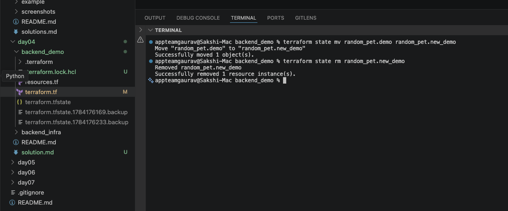
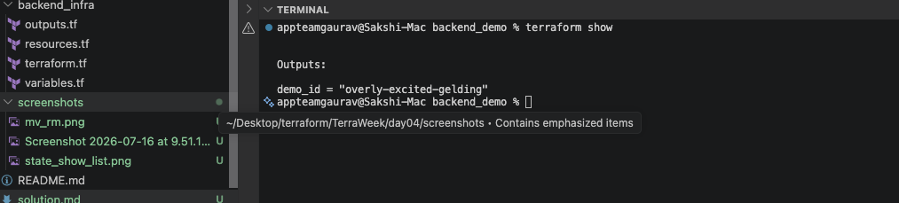
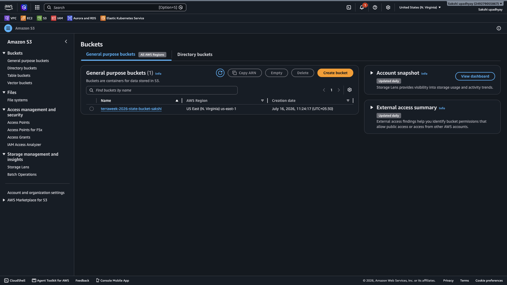
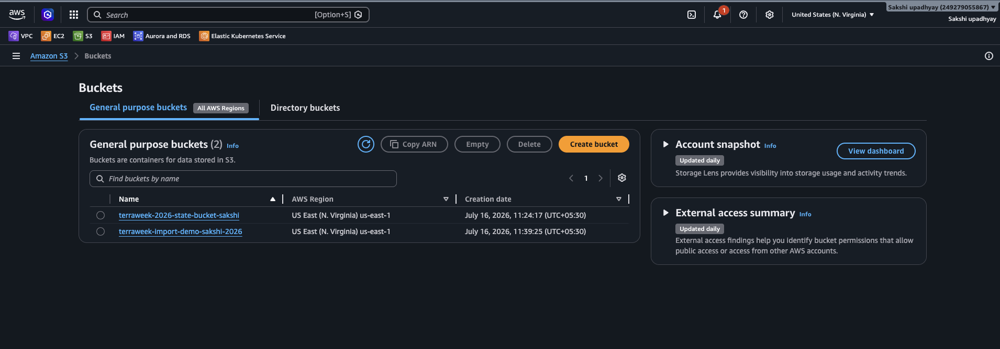
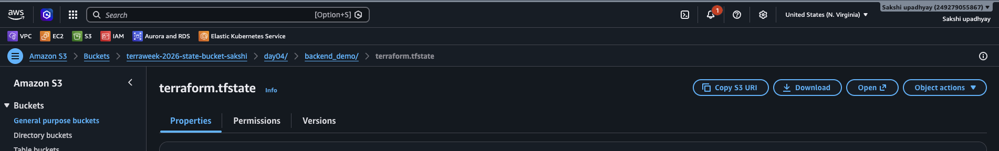
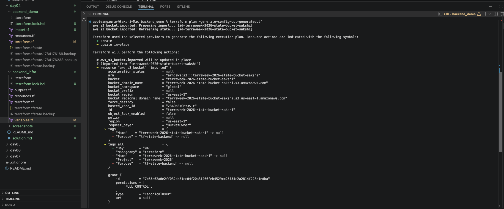
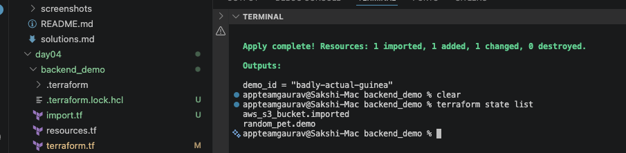

# TerraWeek Day 4 – State & Remote Backends (Native Locking)

**Date:** Wednesday, 15th July 2026

## Learning Goals

* Understand Terraform State and its importance.
* Explore Terraform state commands.
* Configure a remote backend using Amazon S3.
* Enable native S3 state locking using `use_lockfile = true`.
* Import existing resources into Terraform.


---

## Task 1: Why State Matters

### What is `terraform.tfstate`?

`terraform.tfstate` is Terraform's state file that keeps track of all infrastructure resources managed by Terraform. It acts as a source of truth and maps Terraform configuration to real-world infrastructure.

It stores:

* Resource IDs
* Attributes and metadata
* Dependencies
* Outputs
* Provider information

### Why should you never edit it manually?

* Manual changes can corrupt the state.
* Terraform may lose track of resources.
* It can lead to accidental deletion or recreation of infrastructure.

### Why should you never commit it to Git?

* State files may contain sensitive information.
* Team members can overwrite changes.
* Secrets such as passwords or access keys may be stored in plaintext.

Always add the following to `.gitignore`:

```gitignore
*.tfstate
*.tfstate.*
.terraform/
```

### What is State Drift?

State drift occurs when infrastructure is changed outside Terraform (AWS Console, CLI, etc.).

Example:

1. Create an EC2 instance using Terraform.
2. Change the instance type manually in AWS Console.
3. Terraform state no longer matches the actual infrastructure.

Useful commands:

```bash
terraform plan
terraform refresh
```

* `terraform plan` detects differences.
* `terraform refresh` updates the state with current infrastructure values.

### Why is Terraform State Sensitive?

Terraform state can contain:

* Database passwords
* IAM Access Keys
* API Tokens
* Connection Strings
* Sensitive Outputs

Therefore, state should always be:

* Encrypted
* Access controlled
* Stored remotely

---

## Task 2: Terraform State Commands

### List Resources

```bash
terraform state list
```

Lists all resources managed by Terraform.

### Show Resource Details

```bash
terraform state show random_pet.demo 
```
Displays detailed information about a specific resource.


### Move a Resource

```bash
terraform state mv random_pet.demo random_pet.new_demo
```

Used when refactoring Terraform code without recreating resources.

### Remove a Resource from State

```bash
terraform state rm random_pet.new_demo 
```
Removes the resource from Terraform management without deleting it from AWS.




### Display State

```bash
terraform show
```



Shows the current Terraform state in a human-readable format.

| Command                | Description                |
| ---------------------- | -------------------------- |
| `terraform state list` | List all managed resources |
| `terraform state show` | Show resource details      |
| `terraform state mv`   | Rename or move resources   |
| `terraform state rm`   | Stop managing a resource   |
| `terraform show`       | Display the state file     |

---

## Task 3: Bootstrap Backend Infrastructure

Create the S3 bucket for storing Terraform state.

```bash
cd backend_infra

terraform init
terraform apply
```


This creates:

* Versioned S3 Bucket
* Server-side Encryption
* Public Access Block

> Note: The backend bucket itself is initially managed using local state.

---

## Task 4: Configure Remote Backend

### Backend Configuration

```hcl
terraform {
  backend "s3" {
    bucket       = "your-unique-terraweek-state-bucket"
    key          = "day04/terraform.tfstate"
    region       = "us-east-1"
    encrypt      = true
    use_lockfile = true
  }
}
```

### Initialize Terraform

```bash
cd backend_demo

terraform init
```

Terraform prompts to migrate the local state to Amazon S3.

### Apply Changes

```bash
terraform apply
```

### Verification

* Confirm `terraform.tfstate` exists in the S3 bucket.
* Observe `.tflock` appearing during `terraform apply`.
* Verify the lock file disappears after execution.

### Native Locking

Older approach:

```text
S3 + DynamoDB
```

Modern approach (Terraform 1.11+):

```text
S3 + use_lockfile = true
```

Benefits:

* No DynamoDB required.
* Simpler setup.
* Lower AWS cost.
* Native S3 locking.





---

## Task 5: Import Existing Resources

Create an S3 bucket manually using the AWS Console.

### Import Block

```hcl
import {
  to = aws_s3_bucket.imported
  id = "my-manually-created-bucket"
}
```

### Generate Configuration

```bash
terraform plan -generate-config-out=generated.tf
```

Terraform generates a new file:

```text
generated.tf
```

This file contains Terraform code for the imported resource.



### Benefits of Import

* Manage existing infrastructure with Terraform.
* Avoid resource recreation.
* Adopt Infrastructure as Code gradually.

---

## Bonus Tasks

### Compare Remote Backends

| Backend              | Locking Method     |
| -------------------- | ------------------ |
| Amazon S3            | Native Lock File   |
| HCP Terraform        | Built-in           |
| Azure Storage        | Blob Lease         |
| Google Cloud Storage | Generation Numbers |

### Moved Block

```hcl
moved {
  from = aws_instance.old
  to   = aws_instance.new
}
```

### Removed Block

```hcl
removed {
  from = aws_instance.example
}
```

### Check Block

```hcl
check "instance_running" {
  assert {
    condition     = aws_instance.web.instance_state == "running"
    error_message = "Instance is not running."
  }
}
```

---

## Commands Used

```bash
terraform state list
terraform state show <resource>
terraform state mv <source> <destination>
terraform state rm <resource>

terraform init
terraform apply
terraform destroy

terraform plan -generate-config-out=generated.tf
```

---

## Key Learnings

* Terraform State is the source of truth.
* Never commit `.tfstate` files to Git.
* State files can contain sensitive information.
* Remote backends improve collaboration.
* Native S3 locking replaces DynamoDB.
* Existing infrastructure can be imported into Terraform.
* S3 versioning helps recover previous state versions.

---

## Cleanup

```bash
cd backend_demo
terraform destroy

cd ../backend_infra
terraform destroy
```

> Note: Empty the S3 bucket if versioning prevents deletion.

---

## Conclusion

Today, I learned how Terraform manages infrastructure using state files, why state security is important, and how to configure a remote backend using Amazon S3 with native state locking. I also explored Terraform state commands and imported existing resources into Terraform management.

## Tags

```text
#TrainWithShubham
#TerraWeekChallenge
#Terraform
#DevOps
#AWS
#InfrastructureAsCode
```


